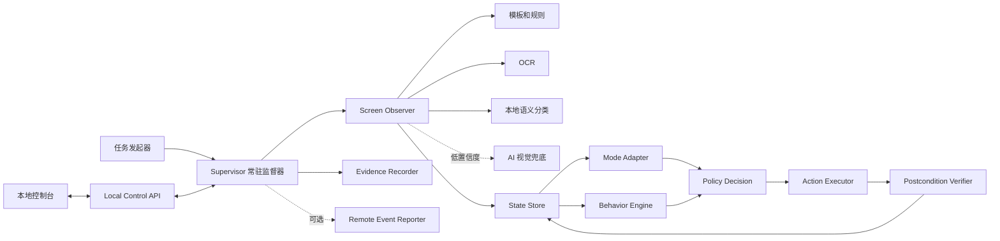

# Apex Controller Lab：可恢复任务运行器设计

> **2026-07-29 方向修正**：本文 §4.6 的「目标 / 进度」模型已被证明是主要故障源。
> 全局单调进度会让任何「落后于已确认阶段」的画面永远收不到输入——一局打完后
> 才弹出的公告页或大厅导览就此永久卡死，而这两者的出现时机本就不确定。
>
> 有序阶段真正想保证的是「不要重复执行重复了会出事的动作」。该性质现已由
> `capabilities.py` 的**幂等分级**（idempotent / toggle / commit）直接表达，
> 顺序因此不再需要：优先级只在同一帧内仲裁，不表达跨帧次序。空转由滑动窗口
> 的状态序列环检测接管，不再依赖进度看门狗。
>
> 另新增**周期触发**，用于画面不变时反复执行的局内行为；它没有后置画面可验，
> 因此装载时拒绝任何非 idempotent 的周期动作。
>
> 同时修正两处由录像目测推参数导致的标定错误，详见
> [菜单改用文字证据](ocr-first-calibration.md)：跳伞跟随/指挥官语义颠倒，
> 以及 `unrankedMatchClick` 落在已锁定的排位赛卡片上。两者都在离线验证
> 100% 通过的情况下存在，因为离线验证只验识别、不验坐标与阈值余量。

> 实施状态（2026-07-28）：阶段 A 已落地；阶段 B 完成“状态/事件/截图 + 暂停/继续/停止/释放输入”薄片；阶段 C/D 完成“区域 OCR + 外置安全规则 + 双次稳定确认 + 动作后置验证”薄片。另已依据完整录像增加独立的 `tutorial` 任务：有序训练子目标、人工登录暂停、训练后四页导览分支和明确选择未上榜三人赛均已完成离线标定；三维走位和标记动作仍需 Windows 实测校准。真实障碍截图标定、模式分类器、局内行为和 AI 兜底仍待实施。

> 文档版本：0.3
> 日期：2026-07-28
> 状态：实施稿 v0.3；快速验证及第一轮主干重构已完成
> 适用环境：固定 Windows 游戏环境、基于屏幕识别和标准输入的显式授权测试
> 当前实现参考：[Windows 首场匹配运行器](windows-first-match-runner.md)

## 0. 本次修订（v0.2）

> 前提变化：快速验证版已经跑通，并暴露了主要痛点（切屏看进度即中断）。本文不再用「先做最小验证、能力放下期」的思路取舍——OCR、本地分类器等一律视为正式基建。本次修订只做两类改动：**修掉不安全 / 会震荡的设计**，**收紧基建原语的定义**；能力范围不缩减。下表即评估清单，正文中 §4.6、§6.1、§9.2、§9.3、§9.4、§22 已按此落地。

| # | 变更 | 类型 | 理由 |
|---|---|---|---|
| 1 | 未知 / 通用弹窗**禁止盲点正向按钮**（claim/continue/confirm）；未知页只允许 Esc 退出或暂停，正向点击只允许发生在已正向识别为安全的页面（§9.4） | 安全修复 | 原白名单套到 `GENERIC_MODAL`/未知页会点穿购买、消耗材料、开包等不可逆选择 |
| 2 | 新增「目标 / 进度」模型 + supervisor 级**停滞看门狗**（§4.6） | 新增 | 纯「当前画面即事实」缺进度概念，会在模式选择上反复横跳、或被「消掉又重弹」的障碍空转 |
| 3 | OCR 收紧为「**区域锚定 + 外置模式字典 + 未命中即暂停（不猜）**」（§9.2） | 约束收紧 | 全屏找模式名又慢又假阳；固定字典遇赛季 / 娱乐模式轮换会静默失效 |
| 4 | 本地分类器角色钉死为「**候选路由器**」，任何发输入的判定必须由模板 / OCR 复核（§9.3） | 约束收紧 | 分类器失败模式是「高置信度答错」，与「不确定就暂停」的安全主线冲突 |
| 5 | 明确 OCR 与分类器的先后是「**数据依赖**」（分类器吃监督器阶段自动存下的未知帧样本），不是优先级（§9.3） | 说明 | 避免被理解成「分类器不重要放后面」 |
| 6 | 过场页「**消除动作优先键盘**」（Esc/Enter/Space）；OCR/模板只用于「识别」，不用于定位按钮再点（§9.4） | 原语选择 | 键盘推进比点定位按钮对布局变化健壮得多；识别与执行分离 |
| 7 | 补「发任务」前置：要求 Apex 已在前台，运行器不 `SetForegroundWindow`（§6.1） | 前置补全 | 该 API 受限且抢前台不安全；`APP_NOT_READY` 只覆盖「没开游戏」，不覆盖「开了但不在前台」 |
| 8 | `aiFallback` 默认改为 `false`，直到 AI 层（阶段 F）实现（§6.1） | 默认值修正 | 原默认开与实现顺序不符 |
| 9 | 本地控制台紧迫性下调：前台可恢复 + `tail events.jsonl` 已能「看进度不中断」，控制台范围收窄为观测，排到主干之后（§22） | 顺序建议 | 控制台是「看进度」痛点的重型解法，有更轻的等价方案 |

## 1. 结论

目标系统不应继续扩展为一条更长的线性脚本，而应重构成一个长期运行、可以暂停和恢复的任务运行器：

```text
用户发起会话任务
  → 识别当前画面，而不是假定起点
  → 模式适配器负责进入目标模式
  → 公共行为引擎根据局内语义状态执行已启用行为
  → 每个动作都验证结果
  → 未知画面先本地重试，再由 AI 辅助分类
  → 仍不能确定时暂停等待，不结束进程
```

V1 任务不需要记录“第几局”。任务只表达本次会话的模式和行为策略，例如：

```powershell
.\run.ps1 start --mode match
.\run.ps1 start --mode entertainment
```

系统默认运行到用户显式停止。是否补充 `--once` 属于独立产品决定，不影响核心架构。

默认状态、事件和截图只保存在 Windows 本机。可视化控制台按需读取状态；没有控制台连接时，运行器仍应完整工作，不要求持续上报远程服务器。

## 2. 背景与当前问题

当前 `ScenarioRunner` 已验证一条固定流程：

```text
CONTINUE
  → LOBBY_READY
  → LEGEND_SELECT（可选）
  → DROPSHIP_JUMPMASTER_WAIT、DROPSHIP_FOLLOWING 或 LAUNCH_READY
  → FREEFALL
  → LANDED
```

这种实现适合验证已知截图链路，但存在明显的封闭世界假设：

- 每一步只等待有限的预期状态；
- 切换前台会被当作异常，而不是可恢复暂停；
- 奖励、升级视频、活动弹窗等计划外页面会导致超时；
- 动作和流程耦合，难以加入周期行为或复活逻辑；
- 用户需要切终端查看日志，而切终端本身又可能触发前台保护；
- 控制台、识别、策略和输入尚未形成独立边界。

目标不是让 AI 直接控制全部操作，而是让系统在安全边界内处理更多未知情况，并在无法判断时优雅降级。

## 3. 目标与非目标

### 3.1 目标

- 从任意可识别页面启动，不强制停在“继续”页；
- 通过任务选项选择匹配模式或娱乐模式；
- 将模式进入流程与公共局内行为分离；
- 前台丢失、短暂黑屏、加载和临时识别失败不导致进程退出；
- 支持模板、OCR、本地语义分类和 AI 兜底；
- 动作执行前检查前置条件，执行后验证结果；
- 支持周期动作、倒地行为和赛后动作的可插拔策略；
- 提供不依赖终端的本地可视化和控制入口；
- 默认不依赖远程服务器；
- 保留可复盘的状态、动作和异常证据。

### 3.2 非目标

- 不读取或修改游戏进程内存；
- 不注入游戏进程，不隐藏输入，不规避反作弊；
- 不让视觉模型产生任意脚本、任意按键或未授权坐标；
- 不在 V1 实现自动导航、目标选择、复杂战斗或资源搜集；
- 不把浏览器模拟或离线截图测试描述成真实环境验证；
- 不要求中央服务器、多机器调度或账号编排。

周期近战、倒地爬行等行为在架构中保留接口，但应默认关闭，只能在明确允许的测试环境中启用。

## 4. 核心设计原则

### 4.1 观察与动作分离

识别器只回答“当前画面是什么”和“证据是什么”。策略层决定是否行动，输入层只执行一个已经批准的抽象动作。

### 4.2 当前画面是事实来源

系统不能因为上一刻处于大厅，就假定下一刻一定进入匹配。每轮决策都以最新稳定画面为准。

### 4.3 未知不等于失败

未知状态默认进入恢复循环：

```text
短暂等待并重新截图
  → 本地多层识别
  → AI 辅助分类
  → 高置信度安全动作
  → 仍不确定则 UNKNOWN_PAUSED
```

只有显式停止、配置损坏、无法满足安全前提等硬错误才终止任务。

### 4.4 一次只执行一个动作

每个动作必须包含：

```text
前置状态
  → 动作
  → 后置状态或可观察变化
  → 超时与有限重试
```

禁止在未知页面连续盲按。

### 4.5 行为必须有租约

持续按键不能依赖正常代码路径释放。行为引擎需要周期续租；租约到期、前台丢失、状态改变或看门狗失联时，输入执行器自动释放全部按键。

### 4.6 目标驱动与进度守护

「当前画面即事实」保证安全，但不保证前进。因此每个模式适配器声明一个有序的子目标序列（例如匹配模式推进到 `IN_MATCH`），主循环每轮选「推进最近一个未满足前置」的动作；清障碍是穿插的全局处理器，消掉后把控制权还给推进序列。

在此之上需要两道额外守护：

- **幂等性**：动作前用已确认的证据判断该步是否已完成（例如 OCR 读到「已选中目标模式」就不再点模式卡），避免把已选的又点回去而来回横跳。
- **停滞看门狗**：基于 `stateVersion` 或「最近一次成功推进的时间」，超过阈值没有前进（含「消掉又重弹」的障碍、两个状态间横跳）就进入暂停，不空转盲按。它是 supervisor 级的守护，与单个动作的有限重试相互独立。

## 5. 总体架构



### 5.1 组件职责

| 组件 | 职责 |
|---|---|
| `TaskLauncher` | 接收模式和行为选项，创建会话任务 |
| `Supervisor` | 维护常驻循环、暂停恢复、超时、看门狗和生命周期 |
| `ScreenObserver` | 从最新帧生成候选语义状态和证据 |
| `StateStore` | 保存稳定状态、状态版本、前台状态和最近事件 |
| `ModeAdapter` | 负责模式选择、出生/复活、结算等模式差异 |
| `BehaviorEngine` | 根据 `ALIVE_GROUND`、`DOWNED` 等公共状态调度行为 |
| `PolicyDecision` | 将任务、状态和安全策略转成一个抽象动作 |
| `ActionExecutor` | 串行发送输入，实施按键租约和全量释放 |
| `PostconditionVerifier` | 验证动作是否生效，决定成功、重试或暂停 |
| `EvidenceRecorder` | 写入事件、关键截图和结果证据 |
| `Local Control API` | 提供状态、事件、截图和任务控制接口 |
| `RemoteEventReporter` | 可选远程事件上报；默认禁用 |

## 6. 任务发起模型

### 6.1 V1 任务参数

V1 不引入局数计数，只使用会话模式：

```json
{
  "mode": "match",
  "sessionPolicy": "untilStopped",
  "behaviors": {
    "meleeIntervalSeconds": null,
    "crawlWhenDowned": false,
    "nextMatchWhenAvailable": false
  },
  "recognition": {
    "aiFallback": false
  }
}
```

可选的模式值：

```text
match
entertainment
```

初期可通过命令行或控制台创建同一个任务对象：

```powershell
.\run.ps1 start --mode match
.\run.ps1 start --mode entertainment
```

控制台不应拥有另一套业务逻辑，它只负责调用同一个任务 API。

运行器**不调用 `SetForegroundWindow`**（该 API 受限，且抢前台本身不安全），但任务对象可以在任何时候创建。创建时 Apex 尚未位于前台则进入 `PENDING_FOREGROUND`；运行中失去前台则进入 `FOREGROUND_PAUSED`。两者都不视为任务失败。用户切回 Apex 后，监督器等待短暂稳定、重新识别当前画面，再从新事实继续；切屏前未确认的动作一律失效。

### 6.2 任务结束

V1 建议以显式停止作为唯一可靠结束条件：

- 控制台点击“停止”；
- 本机紧急停止键；
- Windows 服务被管理员停止；
- 不可恢复的安全错误。

`--once`、固定时长和局数计数可以后续添加，但不应成为状态识别和恢复的基础。

## 7. 模式适配与行为复用

### 7.1 模式适配器

`ModeAdapter` 负责模式特有生命周期。

匹配模式可能包含：

```text
大厅
  → 选择匹配模式
  → 匹配中
  → 英雄选择
  → 运输舰
  → 跳伞
  → 全队淘汰
  → 赛后页面或下一局提示
```

娱乐模式可能包含：

```text
大厅
  → 选择娱乐模式
  → 匹配中
  → 回合开始或直接出生
  → 死亡后复活
  → 回合比分
  → 整场结算
```

娱乐模式的具体页面和复活规则需要后续截图标定，不应直接复用匹配模式的“死亡即结束”判断。

### 7.2 公共行为引擎

行为引擎只依赖语义状态，不依赖进入模式的菜单路径：

| 状态 | 可复用行为示例 |
|---|---|
| `ALIVE_GROUND` | 周期近战、受控的单次按键 |
| `DOWNED` | 按方向爬行、停止攻击行为 |
| `DEAD_OR_SPECTATING` | 释放全部输入并等待模式适配器处理 |
| `FOREGROUND_PAUSED` | 停止调度，释放全部输入 |
| `UNKNOWN_PAUSED` | 不执行局内行为，等待识别恢复 |

模式适配器可以声明能力：

```json
{
  "hasDropship": true,
  "supportsRespawn": false,
  "hasNextMatchHotkey": true
}
```

行为引擎不得通过模式名称推测当前是否安全输入，必须以已确认的语义状态为准。

## 8. 屏幕状态模型

V1 预计控制在 20 个以内的宏观状态：

| 状态 | 含义 | 归属 |
|---|---|---|
| `APP_NOT_READY` | 游戏未运行、未连接或不可捕获 | 全局 |
| `TITLE_CONTINUE` | 标题继续页 | 全局 |
| `LOBBY` | 大厅可交互 | 全局 |
| `MODE_SELECT` | 模式选择页面 | 模式 |
| `MATCHMAKING` | 已准备并正在匹配 | 模式 |
| `LEGEND_SELECT` | 英雄选择 | 模式 |
| `LOADING` | 合法加载或近黑画面 | 全局 |
| `DROPSHIP_JUMPMASTER_WAIT` | 当前是跳伞指挥官，等待可发射 | 匹配 |
| `DROPSHIP_FOLLOWING` | 非指挥官、可脱离；需单独截图标定 | 匹配 |
| `DROPSHIP_JUMPMASTER` | 可自主发射 | 匹配 |
| `FREEFALL` | 自由落体或跳伞 | 匹配 |
| `ALIVE_GROUND` | 已落地且存活 | 公共行为 |
| `DOWNED` | 倒地但未淘汰 | 公共行为 |
| `DEAD_OR_SPECTATING` | 死亡、观战或等待复活 | 模式 |
| `SQUAD_ELIMINATED` | 全队淘汰 | 匹配 |
| `ROUND_RESULT` | 娱乐模式回合结果 | 娱乐 |
| `POST_MATCH` | 整场结算 | 模式 |
| `REWARD` | 奖励、送箱子或领取页面 | 全局恢复 |
| `LEVEL_UP_VIDEO` | 升级动画或视频 | 全局恢复 |
| `GENERIC_MODAL` | 可识别的通用弹窗 | 全局恢复 |
| `UNKNOWN_PAUSED` | 仍无法安全分类 | 全局 |

`FOREGROUND_PAUSED` 是监督器运行状态，不与屏幕语义互斥。例如可以同时记录“最近语义状态为 `LOBBY`，运行状态为 `FOREGROUND_PAUSED`”。

## 9. 分层识别设计

### 9.1 第一层：模板与结构化规则

用于高确定性的固定锚点：

- 按钮文字和图标；
- HUD 固定区域；
- 运输舰提示；
- 自由落体速度尺；
- 倒地、观战、结算等稳定布局。

单个状态可拥有多个模板样本，避免只对一张截图过拟合。

### 9.2 第二层：OCR

OCR 主要识别动作语义，而不是完整理解页面：

```text
继续
准备
取消
跳过
领取
关闭
返回大厅
下一场
按 1
小队已被淘汰
```

OCR 必须做成**区域锚定 + 字典匹配**的原语：只在指定 ROI 内取字、归一化后与一张期望词表比对，而不是全屏搜关键字（全屏搜又慢又假阳）。用于「识别当前模式」时尤其如此——读到的模式名与目标模式比对，作为「已选中」的证据喂给状态，绝不单独触发点击。

模式字典随赛季与娱乐模式轮换而变，必须**外置可配**；OCR 未命中期望词表时进入暂停，而不是猜一个最接近的去点。

### 9.3 第三层：本地语义分类

使用整屏缩略图或区域图像特征，将视觉差异较大的画面归入有限宏观类别。可选实现包括：

- 小型 ONNX 图像分类器；
- 本地图像 Embedding 与多样本原型的距离；
- 多个弱规则的加权分类。

本地分类器的架构角色钉死为**候选路由器**：只输出候选状态和置信度，用来收窄「接下来该匹配哪些模板、读哪块 OCR」，**绝不单独授权任何输入动作**。原因是它与安全主线冲突——模板匹配失败只是「没匹配上 → 未知 → 暂停」（安全），而分类器的失败模式是「高置信度地答错」，会直接触发错误动作；因此任何会发输入的判定，必须再由模板或 OCR 这类确定性证据复核。

分类器与前几层的先后是**数据依赖**而非优先级：它需要样本，而最便宜的样本来源就是监督器 + 模板版本运行时自动存下的未知帧（见 §11.4）。样本就绪后，它可以与其他层并行推进。

### 9.4 第四层：AI 视觉兜底

触发条件建议同时满足：

- 捕获链路健康；
- 连续 3～5 秒没有稳定本地结果；
- 画面指纹与上次 AI 请求不同，或已超过冷却时间；
- 当前没有未完成的输入动作。

AI 输入应包含当前截图、前一张关键截图、候选本地状态和允许动作列表。输出必须是结构化对象：

```json
{
  "state": "REWARD",
  "confidence": 0.93,
  "safeAction": "CLICK_CONTINUE",
  "targetRegion": "BOTTOM_CENTER",
  "reason": "检测到奖励展示和继续按钮"
}
```

允许动作采用白名单，例如：

```text
WAIT
CLICK_CONTINUE
CLICK_SKIP
CLICK_CLOSE
CLICK_CLAIM
RETURN_TO_LOBBY
PAUSE_FOR_USER
```

白名单的授权范围有硬边界：`CLICK_CLAIM`、`CLICK_CONTINUE` 这类**正向点击，只允许发生在已正向识别为安全的页面**（已标定的奖励 / 升级 / 活动模板）。对 `GENERIC_MODAL` 和未知页，只允许 `WAIT`、`PAUSE_FOR_USER`，或用 Esc 退出（back-out），**禁止盲点任何正向按钮**——否则可能点穿购买确认、消耗制作材料或开包等不可逆选择。

执行原语上也要区分「识别」与「消除」：识别用 OCR / 模板，**消除过场页优先用键盘**（Esc/Enter/Space），而不是「OCR 定位到按钮再点坐标」——键盘推进对布局变化健壮得多。

AI 超时、不可用或低置信度时进入 `UNKNOWN_PAUSED`。AI 结果异步返回时必须携带状态版本；如果画面已经变化，丢弃旧结果，禁止执行过期动作。

### 9.5 识别稳定性

每个候选状态至少包含：

```text
state
confidence
evidence
frameId
observedAt
stableForMs
```

建议使用时间窗口而不是固定“两帧”作为唯一判定条件。低延迟状态可要求 300～600ms 稳定，危险动作可要求更长稳定时间或多种独立证据。

## 10. 自适应观察频率

固定每 5 秒或 10 秒截图会漏掉短暂页面，也会让动作显得迟钝。建议按状态调节：

| 场景 | 建议观察频率 | 说明 |
|---|---:|---|
| 大厅、弹窗、模式选择 | 300～800ms | 重点截取 ROI |
| 英雄选择、运输舰、自由落体 | 300～700ms | 对时机较敏感 |
| 正常地面存活 | 1～2s | 判断宏观状态即可 |
| 倒地、死亡、复活 | 300～800ms | 需要及时释放或切换行为 |
| 稳定未知画面 | 2～5s | 避免重复高成本识别 |
| AI 冷却 | 20～30s 或画面变化 | 同一画面不重复调用 |

画面捕获可以保持较高频率，模板/OCR/AI 应分别限频。控制台截图流也应独立限频，不能反向拖慢识别循环。

## 11. 监督器与恢复策略

### 11.1 前台丢失

当前实现把前台错误视为运行失败。目标行为应为：

```text
发现 Apex 不在前台
  → 立即释放全部输入
  → 状态改为 FOREGROUND_PAUSED
  → 继续低频检测进程和前台
  → Apex 恢复前台
  → 等待短暂稳定
  → 重新识别当前画面
  → 从当前状态继续
```

恢复时不得沿用切屏前未完成的动作或 AI 结果。

### 11.2 黑屏和捕获异常

- 单个近黑帧：视为合法过渡；
- 连续近黑帧但进程正常：进入 `LOADING` 并退避重试；
- 捕获返回空帧：重建捕获会话，有限重试；
- 分辨率改变：暂停并要求重新标定，不发送输入；
- 捕获后端持续失败：记录证据并进入硬错误。

### 11.3 输入未生效

```text
确认前置状态
  → 执行动作
  → 等待后置状态或按钮变化
  → 未变化则重新识别
  → 条件仍成立时有限重试
  → 达到上限后暂停，不继续盲按
```

每个动作分别配置最大重试、确认等待和冷却时间。

### 11.4 未知页面

未知页面不能占用主线程长时间等待，也不能立即结束：

- 输入执行器进入空闲并释放按键；
- 保存一张关键截图和识别排名；
- 异步请求 AI；
- 控制台显示未知状态和等待原因；
- 画面变化时立即重新走本地识别；
- AI 仍无法处理时保持暂停，等待用户或新画面。

## 12. 行为引擎

### 12.1 周期近战

周期近战是一个受状态门控的定时任务：

```text
前置条件：ALIVE_GROUND + Apex 前台 + 无弹窗 + 无输入动作执行中
间隔：基于 monotonic clock 的 5 秒
动作：单次 MELEE
后置：重新确认仍处于允许状态
暂停：倒地、死亡、结算、未知、前台丢失
```

间隔从上一次实际执行成功时间计算，不能因暂停后恢复而瞬间补发多次。

### 12.2 倒地爬行

倒地行为必须依赖稳定的 `DOWNED` 状态，并使用短租约：

```text
识别 DOWNED
  → 获取 MOVE_FORWARD 租约 500ms
  → 状态仍为 DOWNED 时续租
  → 任何异常或状态变化立即释放
```

方向、持续时间和是否启用由任务行为配置决定。V1 不规划路线，也不根据敌人位置导航。

### 12.3 下一局动作

“按 1 下一局”必须由模式适配器处理，而不是公共行为引擎盲按：

- 明确识别全队淘汰或赛后状态；
- 同时识别到对应提示；
- 当前任务仍处于运行状态；
- 动作后验证进入加载、匹配或下一局流程；
- 娱乐模式若使用不同复活/下一回合机制，走独立处理器。

## 13. 本地可视化与控制

### 13.1 默认部署

Windows Runner 内置轻量本地 HTTP 服务：

```text
http://127.0.0.1:8765
```

默认不绑定公网地址，不依赖中心服务器。控制台未打开时不发送截图流，也不影响任务运行。

项目已有浏览器实验界面，控制台可以复用当前 React/vinext 工程，但控制台只通过 API 观察和控制 Windows Runner，不在页面中复制自动化逻辑。

### 13.2 控制台信息

- 当前任务模式和启用行为；
- Supervisor 运行状态；
- 当前语义状态、置信度和稳定时间；
- 最近截图及命中 ROI；
- 最近动作、动作验证和重试次数；
- 周期行为下一次执行时间；
- AI 请求、结果和冷却状态；
- 前台暂停、未知暂停和错误原因；
- 事件时间线。

### 13.3 控制操作

- 发起匹配模式任务；
- 发起娱乐模式任务；
- 暂停、继续和停止；
- 开关允许的行为策略；
- 保存当前截图；
- 对未知状态选择“继续等待”或“人工标注”；
- 紧急释放全部输入。

紧急停止键必须继续在 Windows 输入层直接生效，不能依赖网页、网络或 JavaScript。

### 13.4 API 草案

```text
GET  /api/status
GET  /api/events?after=<eventId>
GET  /api/screenshots/latest
POST /api/tasks
POST /api/tasks/current/pause
POST /api/tasks/current/resume
POST /api/tasks/current/stop
POST /api/input/release-all
```

实时事件可以使用 SSE 或 WebSocket。没有客户端连接时，只写本地事件记录。

## 14. 可选远程上报

远程上报不是 V1 前提。使用接口隔离：

```text
Reporter
├── LocalOnlyReporter        默认
└── RemoteEventReporter      可选
```

如果未来需要远程查看，建议只上报事件：

- 30～60 秒心跳；
- 状态变化；
- 动作结果；
- 未知、错误和任务停止；
- 未知或错误时的一张压缩截图。

不持续上传正常游戏截图。远程 Reporter 失败不能阻塞观察、决策或输入线程。

## 15. 事件与证据

### 15.1 事件示例

```json
{
  "eventId": 184,
  "at": "2026-07-28T10:15:30.221+08:00",
  "type": "STATE_CHANGED",
  "from": "FREEFALL",
  "to": "ALIVE_GROUND",
  "confidence": 0.94,
  "frameId": 9122
}
```

### 15.2 截图保留

正常情况下仅保存一个内存环形缓冲区。持久化以下节点：

- 状态变化；
- 动作前后；
- 未知状态；
- AI 请求和验证；
- 错误和最终停止。

截图可能包含玩家名称和其他个人信息，默认仅保存在本机，并提供保留天数和清理策略。

## 16. 并发与实时性

- 捕获线程只负责提供最新帧，不排队处理历史帧；
- 本地识别可以丢弃过期帧；
- AI 调用异步执行，不能阻塞快速状态观察；
- 输入执行器全局串行，同一时间只允许一个动作或一个按键租约集合；
- 控制台截图编码和网络发送使用独立限速线程；
- 每次状态变化递增 `stateVersion`，过期决策和 AI 结果自动失效。

## 17. 失败分类

| 情况 | 分类 | 默认行为 |
|---|---|---|
| 短暂黑屏 | 可恢复 | 进入 `LOADING` 并重试 |
| Apex 失去前台 | 可恢复 | 释放输入并暂停 |
| 未识别弹窗或视频 | 可恢复 | 本地重试、AI、然后暂停 |
| 输入未生效 | 可恢复 | 重新识别并有限重试 |
| AI 服务不可用 | 可恢复 | 保持本地识别和未知暂停 |
| 控制台未打开 | 正常 | 继续运行 |
| 远程上报失败 | 可恢复 | 本地记录，后台退避 |
| 分辨率或 UI 缩放变化 | 需要人工 | 暂停并提示重新标定 |
| 配置文件损坏 | 硬错误 | 拒绝启动任务 |
| 紧急停止 | 显式终止 | 释放全部输入并结束 |

## 18. 配置草案

```json
{
  "task": {
    "mode": "match",
    "sessionPolicy": "untilStopped"
  },
  "behaviors": {
    "meleeIntervalSeconds": null,
    "crawlWhenDowned": false,
    "nextMatchWhenAvailable": false
  },
  "observer": {
    "foregroundPollMs": 500,
    "menuPollMs": 500,
    "groundPollMs": 1500,
    "unknownAiAfterMs": 5000,
    "aiCooldownMs": 30000
  },
  "controlApi": {
    "enabled": true,
    "bind": "127.0.0.1",
    "port": 8765
  },
  "remoteReporter": {
    "enabled": false
  }
}
```

## 19. 实施阶段

### 阶段 A：可恢复监督器

状态：已实现。

- 将线性 `ScenarioRunner` 拆成长期事件循环；
- 增加 `FOREGROUND_PAUSED`；
- 输入租约和统一 `release_all`；
- 当前已知状态可以任意顺序重入；
- 未知状态不退出。

### 阶段 B：本地控制台

状态：已实现观测与当前任务控制薄片；从网页新建任务尚未实现。

- 内置状态 API；
- 展示状态、截图和事件；
- 支持任务启动、暂停和停止；
- 不再要求用户切终端观察。

### 阶段 C：分层识别器

状态：已实现模板、区域 OCR、外置规则和未知样本保存；多模板与本地分类器尚未实现。

- 多模板样本；
- OCR 语义按钮；
- 宏观状态分类接口；
- 自动保存未知样本。

### 阶段 D：模式适配器

状态：已实现匹配模式从继续页到落地的薄片，以及 OCR 安全清障的执行/后置验证框架；娱乐模式和真实障碍截图标定尚未实现。

- 匹配模式；
- 娱乐模式；
- 奖励、升级视频和通用弹窗恢复；
- 每个动作的后置验证。

### 阶段 E：行为插件

- 周期近战；
- 倒地爬行；
- 模式特有的赛后动作；
- 控制台开关和运行证据。

### 阶段 F：AI 兜底和可选远程 Reporter

- 结构化视觉分类；
- 允许动作白名单；
- 异步结果版本校验；
- 可选事件上报。

阶段顺序允许并行开发控制台和本地识别，但不应在可恢复监督器完成前启用周期输入行为。

## 20. 验收场景

目标架构至少应通过以下测试：

1. 在标题“继续”页切出 Windows 前台，不报错；切回后重新识别并继续。
2. 在大厅、匹配中、运输舰和落地状态分别启动任务，能从当前画面接管。
3. 连续出现加载黑屏时不误判捕获后端损坏。
4. 点击准备未生效时能验证并有限重试。
5. 出现升级视频、奖励页或送箱子页面时，能够本地识别、AI 分类或进入未知暂停。
6. AI 服务断开时不影响已知状态流程。
7. 控制台关闭或没有客户端连接时任务继续运行。
8. 周期行为只在允许状态执行，切屏、倒地、死亡和未知时立即停止。
9. 持续按键在进程异常或看门狗超时时自动释放。
10. 远程 Reporter 失败不会阻塞本地任务。

## 21. 待讨论问题

1. V1 会话是否始终运行到用户停止，还是同时提供 `--once`？
2. “匹配模式”是否固定为三人赛，还是需要更细的模式枚举？
3. “娱乐模式”指固定入口，还是当前轮换中的任一娱乐模式？
4. AI 使用远程视觉 API、本地模型，还是两者可切换？
5. AI 可以自动点击哪些通用按钮，哪些必须暂停等待用户？
6. 周期近战、倒地爬行和下一局动作的默认值是否全部关闭？
7. 控制台只允许本机访问，还是需要局域网访问？
8. 关键截图保存多久，是否需要自动清理或脱敏？
9. 未知页面人工标注后，是否自动生成新的本地识别样本？
10. 如何限定真实环境使用范围并明确账号、服务条款与反作弊风险？

## 22. 当前建议

下一轮讨论优先确认四件事：

1. 任务结束语义：持续到停止，还是需要单局模式；
2. 匹配模式和娱乐模式的准确业务定义；
3. AI 自动动作白名单；
4. 控制台访问方式：仅 Windows 本机，还是允许 Mac/手机局域网访问。

当前优先级改为：先用真实 Windows 运行验证阶段 A 与 B；对实际出现的奖励、升级、送箱子画面做 OCR ROI 标定并逐条武装阶段 C/D 规则。验证通过后再实现本地候选分类器和阶段 E 行为插件；AI 兜底仍保持默认关闭。
